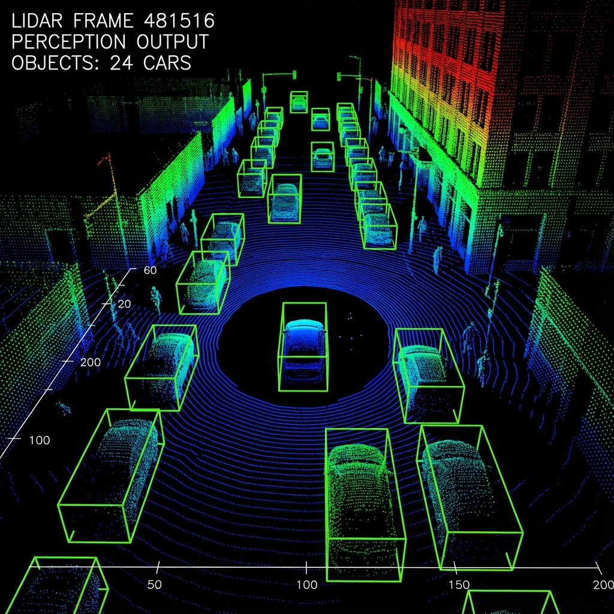

# 3D Object Detection with Sensor Fusion

This project implements a robust sensor fusion model for 3D object detection, specifically designed for autonomous driving applications using the KITTI dataset. It leverages a deep learning approach inspired by PointFusion to combine high-resolution image data with precise LiDAR point cloud data.

## Features

- **Multi-Modal Sensor Fusion**: Seamlessly integrates features from Camera (RGB) and LiDAR (Point Cloud) to improve detection accuracy.
- **Flexible Backbone Architecture**: 
    - **Image Stream**: Configurable to use either **ResNet50** for deep feature extraction or **YOLOv5** for real-time performance.
    - **LiDAR Stream**: Utilizes **PointNet** to process raw point clouds directly.
- **Unsupervised Learning Capability**: Includes an unsupervised loss function option for training without dense annotations.
- **Robust Training Pipeline**: Integrated validation loop, checkpointing, and real-time logging with **WandB**.
- **Inference & Visualization**: Tools to run inference on new samples and visualize 3D bounding boxes on point clouds.

## Project Structure

The repository is organized as follows:

- **`Backbone/`**: Contains the neural network model definitions.
    - `pointfusion.py`: The core fusion module.
    - `Pointnet/`: PointNet implementation for LiDAR processing.
    - `Yolov5/`: YOLOv5 integration for image processing.
- **`Config/`**: Configuration management.
    - `train_test.yaml`: Main configuration file for training and testing parameters.
    - `kitti_config.py`: KITTI-specific constants and settings.
- **`DataProcess/`**: Data loading and preprocessing pipelines.
    - `kitti_dataset.py`: PyTorch Dataset implementation for KITTI.
    - `kitti_utils.py`: Utilities for geometry and data transformation.
- **`Utils/`**: Helper functions for visualization and metrics.
- **`train.py`**: Main script for training the model.
- **`inference.py`**: Script for running inference and generating results.

## Installation

### Prerequisites
- Linux OS
- Python 3.8+
- CUDA-enabled GPU (recommended)

### Steps

1. **Clone the Repository**
   ```bash
   git clone <repository_url>
   ```

2. **Install Dependencies**
   It is recommended to use a virtual environment (e.g., Conda or venv).
   ```bash
   pip install -r requirements.txt
   ```

3. **Prepare the Dataset**
   Download the [KITTI 3D Object Detection Dataset](http://www.cvlibs.net/datasets/kitti/eval_object.php?benchmark=3d).
   Update the `root_dir` in `Config/train_test.yaml` to point to your dataset location:
   ```yaml
   dataset:
     root_dir: /path/to/your/kitti/dataset
   ```

## Usage

### Training

To start training the model, run:

```bash
python train.py
```

You can modify training parameters like batch size, learning rate, and backbone choice in `Config/train_test.yaml`.

### Inference

To run inference on the test set or specific samples:

```bash
python inference.py --checkpoint checkpoints/best_model.pth --visualize
```

### Visualization

The project includes tools to visualize the 3D bounding boxes on the LiDAR point cloud. Below is an example of the output, showing detected vehicles with their estimated 3D bounding boxes.



*Figure 1: Visualization of 3D bounding boxes on a LiDAR point cloud.*

## Configuration

The `Config/train_test.yaml` file allows you to customize the experiment:

```yaml
dataset:
  backbone: resnet # Options: 'resnet' or 'yolov5'
```

## References

- [PointFusion: Deep Sensor Fusion for 3D Bounding Box Estimation](https://arxiv.org/abs/1711.10871)
- [PointNet: Deep Learning on Point Sets for 3D Classification and Segmentation](https://arxiv.org/abs/1612.00593)
- [YOLOv5](https://github.com/ultralytics/yolov5)
